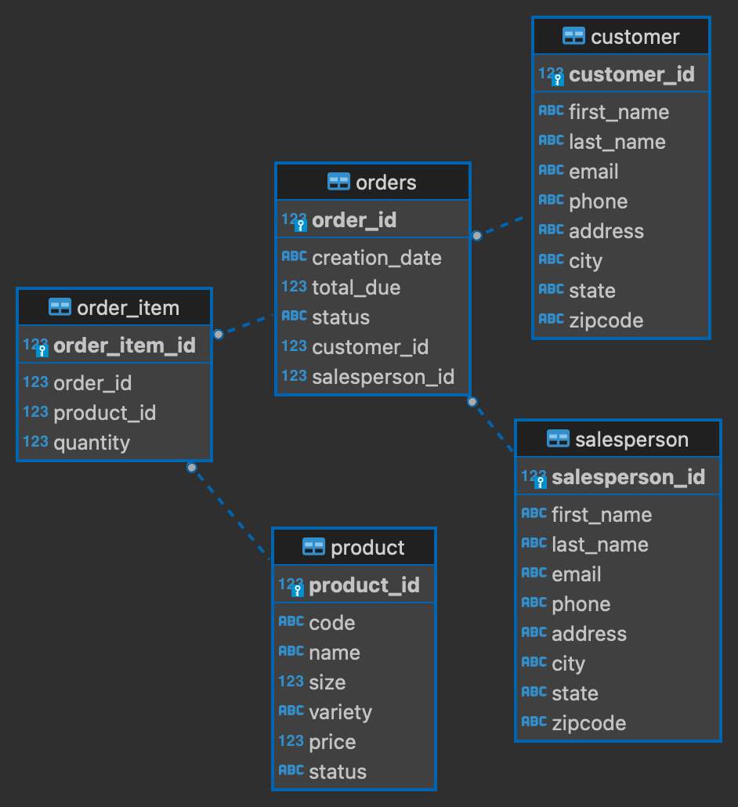

# Introduction
This app utilizes the Java Database Connectivity (JDBC) API to set up an RDBMS agnostic interface for programmatically performing create, read, update, and delete (CRUD operations) upon a dataset in a  PostgreSQL database. Several SQL queries were ran against a PostgreSQL database to set up the initial tables and data, all from within an instance of a Docker container. Maven was used as the project build tool. Testing was done manually due to the small scale of data, verifying if CRUD operations were propagated successfully to the database through the JDBC driver by logging into the database on PSQL and querying for the modified records.

# Implementation
## ER Diagram

## Design Patterns
Discuss DAO and Repository design patterns (150-200 words)
Though this project for the most part operated on a singular table, the Data Access Object (DAO) design pattern was chosen over the Repository pattern. Given that the data in the database was highly normalized and thus making JOIN operations very simple, it made implementing DAOs and the corresponding DTOs for the tables that would be operated on very easy. 

While the repository pattern has its merits (namely for smaller databases, it is more than feasible to handle any JOINs or minor technicalities within queries programmatically rather than letting the database take care of it like in DAO), I ultimately ruled against it. The abstraction between the business logic and underlying persistent storage is far more defined and concrete with DAOs, making separation of concerns far easier to logic out. Additionally, while the repository pattern is better at scaling horizontally, DAOs tend more towards agile practices, as once you get the overall CRUD operations written out, the layout can be modelled similarly for other tables in the same database, rewarding careful schema design with quick setup (with no/negligible loss in performance).

# Test
The app was tested manually by logging into the PostgreSQL database and verifying various CRUD operations were carried out. After each set of queries, I would check against the tables to make sure the respective entries were updated.
