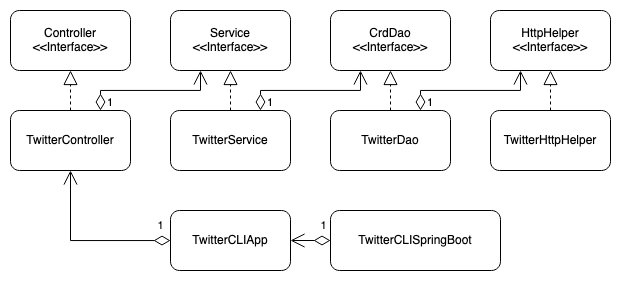

# Introduction
This app allows the user to create, find, and delete tweets from their command line. The user can create a tweet on a given account (given that they have access to the respective consumer and access tokens/secrets), find tweets by their id and fetch specific information of said tweets, or delete multiple tweets by their id all at once. The app does all of this by leveraging Twitter REST API v2, making HTTP requests to the respective endpoints via Apache HttpClient, and authorizing the requests through OAuth Signpost. The app's architecture follows the standard model-view-control (MVC) pattern, with the respective backend components managed through the Spring framework. Serialization to and from the tweet JSON object for respective API calls is handled through the Jackson library. Maven was used as the build management system, with deployment handled through docker.

# Quick Start
You can package the app through the following maven command into a JAR file. Note that for all tests to pass, environment variables for `consumerKey`, `consumerSecret`, `accessToken`, and `tokenSecret` must all be set (i.e. `export consumerKey=VALUE`).
```shell
mvn clean compile package
```

Alternatively, if you just want to run the app without any of the packaging steps, you can pull down the disk image from DockerHub.
```shell
docker pull shahiro777770/twitter
```
From here you can run the docker image with the below command (sample commands)

```shell
docker run --rm \
-e consumerKey=${consumerKey} \ 
-e consumerSecret=${consumerSecret} \
-e accessToken=${accessToken} \
-e tokenSecret=${tokenSecret} 
${docker_user}/twitter show tweetId
```

### Syntax

Basic syntax for the app is as follows:
```shell
twitter post|show|delete [options]
```

#### Post
Posting a tweet is the most straight-forward.

```shell
twitter post "tweet text #hashtagText"
```

#### Show
For showing a tweet, you may specify from a limited set of fields specific data you want to see
through a comma seperated list following the tweet id. If no list is present, all of the fields are returned
in the outputted tweet information.
```shell
twitter show tweetId "id,text,entities,public_metrics,created_at"
```

#### Delete
Multiple tweets may be deleted at once if multiple ids are passed through a comma seperated list of ids.
```shell
twitter delete "id1,id2,id3,..."
```

# Design
## UML diagram

## Components
#### TwitterHTTPHelper
* Handles sending HTTP requests to designated URIs, attaching any relevant entities to the request bodies
* Takes in the respective keys and secrets to signs requests using the OAuth Signpost library
#### TwitterDao
* Data access object for serializing the Tweet data structure to and from the HTTP responses given by the Twitter REST API v2
* Calls the TwitterHTTPHelper with the relevant information based on the API call the DAO is requested to make
#### TwitterService
* Performs business logic involved in constructing Tweets or determining what needs to be passed to the TwitterDao based on the information provided by the controller
* Does validation on the user's input, throwing errors if illegal arguments are passed in
#### TwitterController
* Calls the corresponding service (in this case, only the TwitterService) and method depending on the input from the user
#### TwitterCLIApp
* Main entry-point for usage of the app, passing the user's command line arguments down to the TwitterController
* Handles displaying output of the API calls from Tweet data passed up from the controller
#### TwitterCLISpringBoot
* Handles configuring all other components and their dependencies through the Spring framework
## Models
The Tweet model serves as the data transfer object (DTO) from the JSON formatted responses of the Twitter API
to a malleable Java object. For simplicity, it doesn't encompass all fields of an actual tweet, prioritizing the most relevant/basic information. A tweet itself contains a data object, which holds a variety of tweet properties, which in this case, consist of the tweet's text, id, creation date, entities (hashtags and mentions) and public metrics (likes, retweets, etc.).
## Spring
- How you managed the dependencies using Spring?
  Given MVC was used as the architectural pattern for for this project, it made sense that managing the creation of dependencies between the three layers could be hassle. Using the Spring framework, the creation and injection of the various components and dependencies is handled via the component scan approach, minimizing work needed to manually specify dependencies in the configuration. Spring Boot was used to manage my Spring framework configuration, though the web servlet was disabled as this application is meant to be run locally on the command line.

# Test
Unit tests were done for all components in the app through JUnit4 and Mockito, mocking dependencies for components further from the model layer to minimize influence from the Twitter API and network instability. Integration tests were done as well through the same frameworks, verifying that each component could properly send input and receive from the layers below it. This did result in some challenge, as Twitter API outages could on rare occasion affect integration test results.

## Deployment
A Docker image containing the compiled fat JAR with the necessary dependencies was deployed to DockerHub for ease of access and modification. The docker image file in specific used openjdk:8-alpine as its base image. From there, the contents of the JAR file were copied to a specific directory such that when the container would be run, the jar file would be run via the command `java -jar` when the container starts up.

# Improvements
- Additional unit tests to handle all edge cases would be nice to add
- Handling more fields/properties of a Tweet to give users further functionality
- Gracefully handling errors such that the app, rather than just throwing an exception, allows the user to re-input a new command and remove the awkward restarting of the app